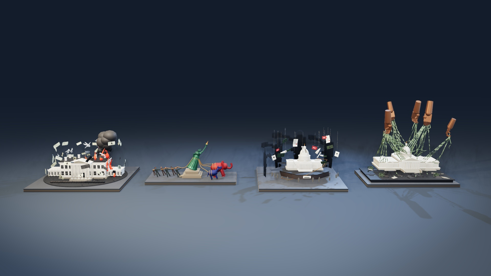

# Four political sculptures — 75-second film

[Watch or download the film on GitHub](https://github.com/karthiksrikumar/personalwebsite/raw/refs/heads/main/film/output/political-sculptures-75s.mp4).

1920 × 1080, 24 fps, 75 seconds, H.264 with stereo AAC audio. The film includes exactly **Price of Power, Liberty Tug of War, Capitol at Auction, and Capitol Marionette**. No text overlays are added.



## Camera and construction design

Every camera is fitted to the measured, full geometry of its sculpture. The camera solver projects all eight bounding-box corners, accounts for object depth and camera elevation, and reserves breathing room around the outermost parts. Closer views retain a full-model safety constraint, including Marionette's raised hands and Liberty's people and party animals. The collection uses four separate pedestals in a single row; their projected bounds are checked for overlap.

The 16-second Liberty build reveals 360 horizontal layers through the actual source meshes. Parts stay at their final coordinates throughout. Stencil cross-sections close the visible cut surfaces with their original material colors. Clipped geometry also stops casting shadows. Ambient occlusion and the depth-of-field pass are disabled during construction so their depth buffers cannot reveal unbuilt surfaces.

| Time | Shot |
| --- | --- |
| 0–7s | Wide introduction to the four separated sculptures |
| 7–16s | Price of Power: full view, then a measured push toward the building |
| 16–25s | Liberty Tug of War: establish both sides, then move closer |
| 25–34s | Capitol at Auction: wide view, then architecture and auction details |
| 34–43s | Capitol Marionette: building, strings, and hands remain visible |
| 43–59s | Liberty forms from the bottom upward in fixed, solid layers |
| 59–66s | Completed Liberty, with a gradual closer view |
| 66–75s | Four-piece finale; camera holds from about 72.1s; fade at 74s |

Lighting uses large warm and cool softboxes, moving key illumination, rim light, an environment-light approximation, and a seamless slate backdrop. Materials preserve the MTL color and opacity values, with added physical roughness and metalness. Rendering uses shadow maps, screen-space ambient occlusion, environment reflections, restrained depth of field, multisample antialiasing, ACES tone mapping, and two shutter samples per frame. This is a rasterized PBR scene rather than a path-traced scene.

## Source assets

Only these pairs are loaded, directly from `obj/`:

- `price-of-power.obj` / `.mtl`
- `liberty-tug-of-war (1).obj` / `.mtl`
- `capitol-at-auction.obj` / `.mtl`
- `capitol-marionette.obj` / `.mtl`

Liberty's downloaded files have a `(1)` suffix, while its embedded `mtllib` line uses the unsuffixed filename. The scene explicitly loads the provided suffixed MTL and assigns it to the OBJ loader. The original files remain intact. The other sculptures and the head STL are excluded.

`analyze-models.py` measures the vertices referenced by each named component and records exact source bounds and triangle counts. Rendering batches geometry by material without reducing triangle counts. `scene.mjs` contains the complete scene, camera, lighting, materials, construction animation, and timeline; no Blender project is needed.

## Reproduce

From the repository root, with Node 22+, Python 3.12+, and WebGL2-capable Chromium:

```sh
npm ci
npx playwright install chromium
python -m pip install numpy pillow imageio-ffmpeg
python film/analyze-models.py
node film/render.mjs --preview
node film/verify-scene.mjs
node film/render.mjs
python film/finish.py
node film/verify-playback.mjs
```

Set `CHROME_PATH` to use an existing Chromium executable. Set `FFMPEG_PATH` to use an existing FFmpeg executable with libx264 and AAC support. The encoder is otherwise found through the Python `imageio_ffmpeg` package or a project-local installation in `.cache/film-tools`.

Previews go to `.cache/film75-preview`; the full render writes 1,800 JPEG frames to `.cache/film75-frames`. Interrupted renders resume by skipping existing frames. **Clear that exact frame directory after changing the scene or assets before a complete rerender.** An intentional partial replacement is available with `node film/render.mjs --only=16:25`; ranges use seconds and exclude the end time.

`finish.py` generates an original evolving ambient score with accents aligned to the layer build, encodes the MP4 with BT.709 color metadata, and fully decodes both streams to check the result. No outside music recordings are used.

## Verification

- `output/geometry-analysis.json`: source geometry bounds for every component of the four requested models.
- `output/model-inventory.json`: only the four selected assets, materials, and preserved triangle counts.
- `output/assembly-parts.json` and `assembly-events.json`: normalized Liberty bounds and sound cue times.
- `output/scene-verification.json`: asset-loading, framing, separation, and near-camera checks sampled every half second.
- `output/contact-sheet.jpg`: representative frames, including several stages of construction.
- `output/verification.json`: 75-second duration, 1,800 decoded frames, resolution, source/video checksums, audio levels, and browser playback through the ended event.

Sampled camera checks supplement visual review; they are not an exhaustive geometric collision proof.

## Local storage cleanup

After committing and pushing, `cleanup-local.ps1 -Commit <full-commit-sha>` verifies that GitHub `main` matches the commit, then streams the actual remote MP4 through SHA-256 and compares it with the verified local video. Only after those checks does it remove local video copies, old and new film frame caches, scratch soundtracks, preview caches, and the cached encoder. Models, source scripts, and small review/verification artifacts remain.

The committed 75-second MP4 is marked `skip-worktree` before its local copy is removed, so local cleanup does not delete the GitHub artifact. Download it from the link above, or restore the working copy with:

```sh
git update-index --no-skip-worktree film/output/political-sculptures-75s.mp4
git restore --source=HEAD -- film/output/political-sculptures-75s.mp4
```

Git history is retained, so the Git object database still contains committed video data.
